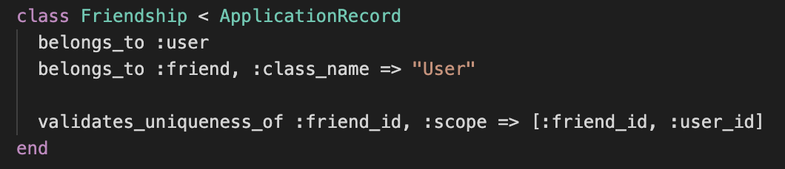
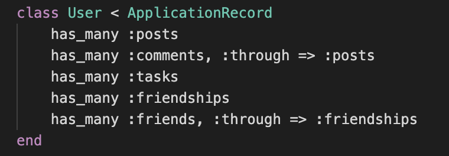
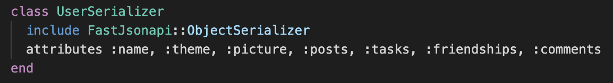
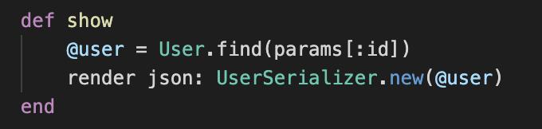

# Humanatee Server-side

This RESTful backend is built with Ruby on Rails

* This cutting edge social media website features a self referential user table which allows for users to 'have many' users as friends.

* more on that...

### Model

   
   Comments >--- Posts >--- User ---< Tasks
        &&
   User >--- User's (through friendships)

   User has many posts, posts have many comments
   User also has many tasks

### User profile data structure

   * User profile object includes information on user's settings, posts to message board, each post's comments, user's tasks, and friendships.
   

   

User's information was serialized using Netflix's FastJson

### Assets
   * Ruby on Rails
   * ActiveRecord
   * Postgresql
   * Fast JSON API

#### Credits
   * Serialization : thanks to Fast JSON API
      * [link to FastJson!](https://github.com/Netflix/fast_jsonapi)
   * Thanks to Flatiron School for support
